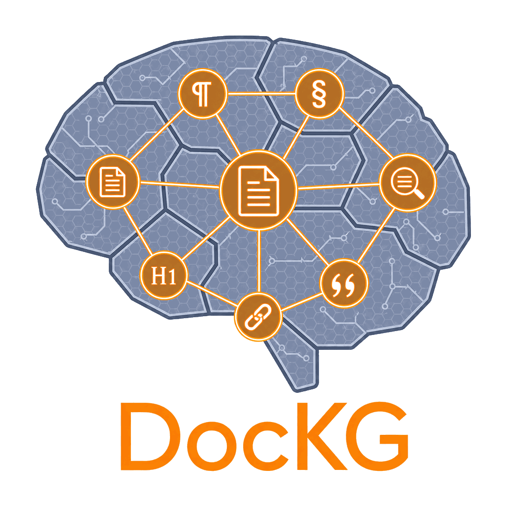
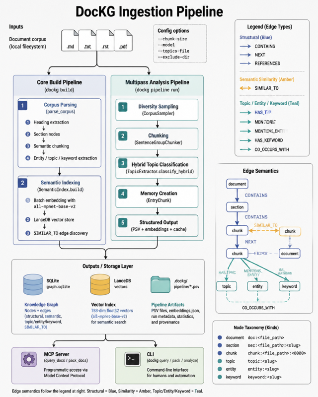

<p align="center">
  
</p>

[](https://github.com/Flux-Frontiers/doc_kg/actions/workflows/publish.yml)
[](https://www.python.org/)
[](https://www.elastic.co/licensing/elastic-license)
[](https://github.com/Flux-Frontiers/doc_kg/releases)
[](https://python-poetry.org/)
[](https://doi.org/10.5281/zenodo.19770973)

# DocKG — A Knowledge Graph for Document Corpora

**DocKG turns a document corpus into a deterministic, queryable knowledge graph — and uses it to produce source-grounded passage packs that LLMs can actually trust.**

It walks every `.md`, `.txt`, `.rst`, and `.pdf` file in your corpus, chunks the text with heading-aware segmentation, extracts topics, named entities, keywords, and cross-document references, and stores the result in SQLite. A LanceDB vector index sits alongside the graph so that both *"authentication flow"* and *"configure the webhook"* find the right passage to start from. From there you can rank chunks by structural importance, trace how documents reference each other, snapshot corpus health metrics across time, or hand the whole thing to Claude over MCP.

The design philosophy is borrowed from its sibling [PyCodeKG](https://github.com/Flux-Frontiers/pycode_kg): **structure is ground truth; embeddings are an acceleration layer**. This is a deliberate departure from standard RAG. Vanilla RAG embeds chunks in isolation and retrieves by cosine similarity alone — it has no model of which section a chunk belongs to, no awareness of cross-document references, and no way to suppress a redundant document-level summary when a more specific chunk is already in the result set. The retrieved context looks plausible but is structurally blind. DocKG keeps the vector index for semantic seeding, then expands through a typed graph so that structural relationships — containment, sequencing, citation, similarity — shape what gets returned. When the graph and the vector index disagree, the graph wins. Every retrieved passage is traceable to a specific file, heading, and character offset. There are no hallucinated citations because there is no inference — every result is computed from the graph.

Everything runs on your laptop. No cloud APIs, no quotas, no documents leaving the machine.

*Author: Eric G. Suchanek, PhD — Flux-Frontiers, Liberty TWP, OH*

---

## Sister projects

DocKG is part of the **KGRAG** family — a suite of knowledge-graph systems sharing the same hybrid semantic-plus-structural design, each targeting a different kind of corpus:

- **[PyCodeKG](https://github.com/Flux-Frontiers/pycode_kg)** — Python source code. AST-extracted modules, classes, functions, and their typed relationships.
- **[MetaboKG](https://github.com/Flux-Frontiers/metabo_kg)** — metabolic pathway data (KEGG, SBML, BioPAX) with FBA / ODE simulation on top of the graph.
- **[DiaryKG](https://github.com/Flux-Frontiers/diary_kg)** — personal journals and diary corpora; semantic search and graph traversal over a writer's body of work.
- **[FTreeKG](https://github.com/Flux-Frontiers/FTreeKG)** — filesystem trees as a queryable graph of directories, files, and contents.
- **[AgentKG](https://github.com/Flux-Frontiers/agent_kg)** — conversational memory as a knowledge graph: turns, decisions, commitments, and the relationships between them.

Together they form **KGRAG**, a federated retrieval layer where one query can span documents, code, journals, filesystems, and agent memory simultaneously.

---

## Two ways to use it

DocKG is designed to be useful at both ends — as a standalone command-line tool for corpus analysis, and as a structured context layer for AI agents.

### 1. Standalone — `dockg build` + `dockg pack`

Build the index once, then query it:

```bash
dockg build docs/                                     # full pipeline — graph + vectors
dockg query "authentication flow"                     # hybrid search, ranked results
dockg pack "configuration reference" --format md      # source-grounded passage pack
dockg analyze docs/                                   # corpus health report + snapshot
```

`pack` is the workhorse. It seeds on vector similarity, expands through the document graph (`CONTAINS`, `REFERENCES`, `SIMILAR_TO`, `NEXT`), deduplicates coarser nodes when their chunks are already present, and returns a ranked, excerpt-annotated set of passages ready to paste into an LLM prompt. The output is grounded: every snippet carries its source path, heading, and character range.

`analyze` walks the graph and produces per-document metrics — chunk counts, section depth, entity density, hot chunks by connectivity — plus an overall coverage score and a timestamped JSON snapshot for CI gates and trend tracking.

### 2. Agentic — MCP server for grounded AI workflows

Run `dockg-mcp` and Claude (or any MCP-aware client) gets four focused tools backed by the same graph: `graph_stats`, `query_docs`, `pack_docs`, and `get_node`. Setup for Claude Code, Claude Desktop, Kilo Code, Copilot, and Cline is a single JSON entry — see [docs/MCP.md](docs/MCP.md).

The agent benefit is the same as with PyCodeKG: tools return *actual text* with source attribution rather than the model's best reconstruction from training data. Multi-step workflows — *"find the deployment section, check what it references, summarise what would need updating if the port changes"* — become a handful of grounded calls instead of repeated file reads.

---

## Get started in 60 seconds

**Requirements:** Python ≥ 3.12, < 3.14

```bash
pip install doc-kg

cd /path/to/your/corpus
dockg build .                     # index the corpus
dockg query "your question"       # hybrid search
dockg pack  "your question"       # LLM-ready passage pack
```

Variants (editable install, Streamlit visualizer, MCP setup, contributor setup) are in [docs/INSTALLATION.md](docs/INSTALLATION.md).

---

## How retrieval works

<p align="center">
  
</p>

Search is hybrid by design. A query runs in two phases:

1. **Vector phase** — the query is embedded with a local sentence-transformer (`BAAI/bge-small-en-v1.5`, cached after first download) and LanceDB returns the `k` closest chunks by cosine similarity.
2. **Graph expansion phase** — each seed hit is expanded `hop` BFS steps along typed edges (`CONTAINS`, `REFERENCES`, `SIMILAR_TO`, `NEXT`) so co-cited passages and structurally adjacent sections surface alongside the direct semantic matches.

A **deduplication pass** then suppresses coarser nodes (document, section) from files where finer chunks are already present — the pack contains the most specific evidence available, not redundant summaries of the same content.

A **short-chunk boost** surfaces factual asides and single-sentence callouts that would otherwise be buried by longer, topically mixed passages. Micro-fragments below 50 characters are excluded from boosting and from the index entirely.

---

## What you can do with it

| If you want to… | Reach for | Detail |
|---|---|---|
| **Index a corpus** | `dockg build .` | [docs/CLI.md](docs/CLI.md) |
| **Search for a topic** | `dockg query "..."` | [docs/CLI.md](docs/CLI.md) |
| **Build an LLM context pack** | `dockg pack "..."` | [docs/CLI.md](docs/CLI.md) |
| **Analyze corpus health** | `dockg analyze .` | [docs/CLI.md](docs/CLI.md) |
| **Snapshot and diff metrics** | `dockg snapshot save / diff` | [docs/SNAPSHOTS.md](docs/SNAPSHOTS.md) |
| **Browse the graph interactively** | `dockg viz` (Streamlit) | [docs/INSTALLATION.md](docs/INSTALLATION.md) |
| **Wire it into Claude / Copilot / Cline** | `dockg-mcp` | [docs/MCP.md](docs/MCP.md) |

---

## Documentation map

| Doc | What it covers |
|---|---|
| [docs/INSTALLATION.md](docs/INSTALLATION.md) | All install variants, MCP setup, git hooks, troubleshooting |
| [docs/CLI.md](docs/CLI.md) | Every `dockg` subcommand and flag |
| [docs/MCP.md](docs/MCP.md) | MCP server setup for Claude / Kilo / Copilot / Cline, tool reference |
| [docs/SCHEMA.md](docs/SCHEMA.md) | Node kinds, edge types, storage layout, node ID format |
| [docs/SNAPSHOTS.md](docs/SNAPSHOTS.md) | Temporal snapshots, diffing across corpus versions |
| [docs/CHEATSHEET.md](docs/CHEATSHEET.md) | Quick-reference: CLI flags and MCP tools on one page |
| [CHANGELOG.md](CHANGELOG.md) | Release history |

[Technical Paper (PDF)](https://github.com/Flux-Frontiers/KGRAG/blob/main/articles/kgrag.pdf) — the KGRAG architecture paper covering the full federated KG-RAG stack of which DocKG is a part.

---

## Citation

If you use DocKG in research or a project, please cite it:

[](https://doi.org/10.5281/zenodo.19770973)

**APA**

> Suchanek, E. G. (2026). *DocKG: Hybrid Knowledge Graph for Document Corpora* (Version 0.16.0) [Software]. Flux-Frontiers. https://doi.org/10.5281/zenodo.19770973

**BibTeX**

```bibtex
@software{suchanek_doc_kg,
  author    = {Suchanek, Eric G.},
  title     = {{DocKG}: Hybrid Knowledge Graph for Document Corpora},
  version   = {0.16.0},
  year      = {2026},
  publisher = {Flux-Frontiers},
  url       = {https://github.com/Flux-Frontiers/doc_kg},
  doi       = {10.5281/zenodo.19770973},
}
```

---

## License

[Elastic License 2.0](LICENSE) — free for non-commercial and internal use; commercial redistribution or hosting requires a license from Flux-Frontiers.

---

## Support

- **Issues** — [GitHub Issues](https://github.com/Flux-Frontiers/doc_kg/issues)
- Sister projects: [PyCodeKG](https://github.com/Flux-Frontiers/pycode_kg), [AgentKG](https://github.com/Flux-Frontiers/agent_kg), [MetaboKG](https://github.com/Flux-Frontiers/metabo_kg)
- Built on: LanceDB, sentence-transformers, SQLite, Streamlit, and FastMCP

---

*Built for writers, researchers, and AI agents that work alongside them — egs · Last updated June 2026*
